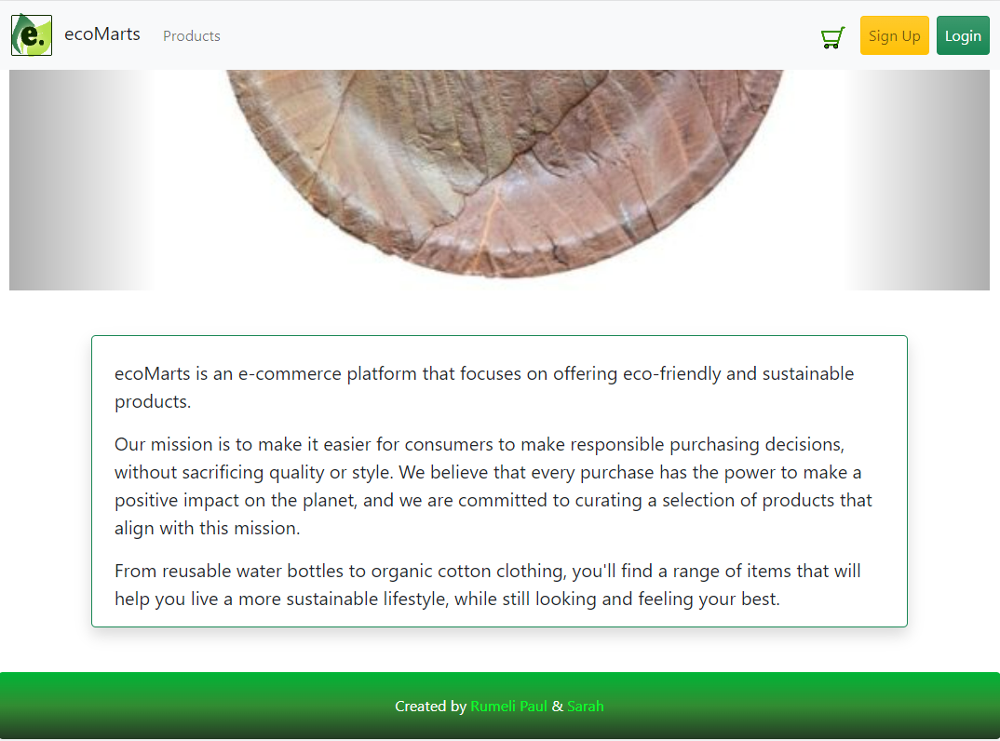
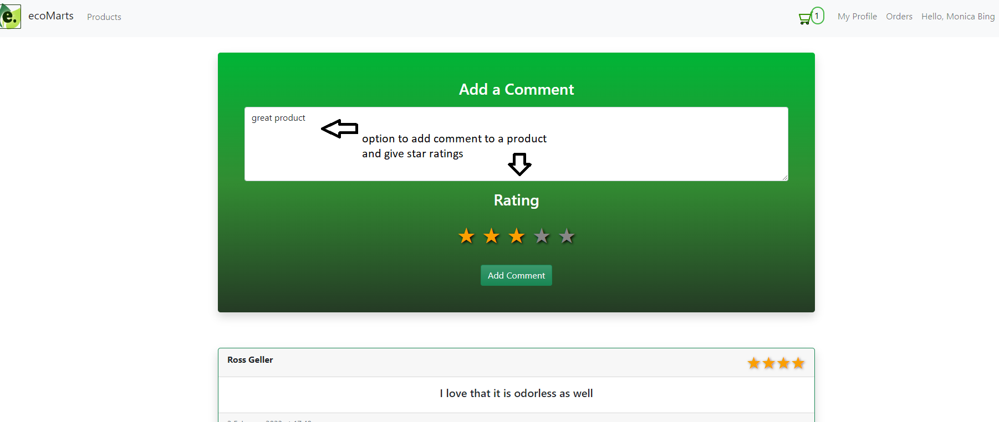
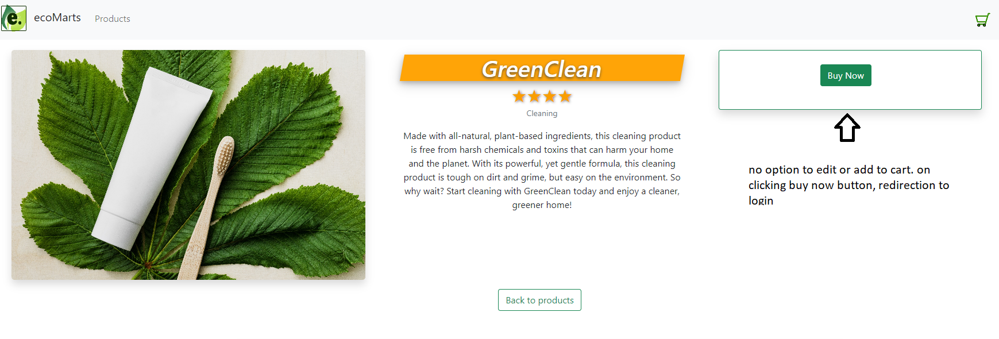

# ecoMarts

ecoMarts is an e-commerce platform that focuses on offering eco-friendly and sustainable products.


## About this app:

Our mission is to make it easier for consumers to make responsible purchasing decisions, without sacrificing quality or style. We believe that every purchase has the power to make a positive impact on the planet, and we are committed to curating a selection of products that align with this mission.

## Created By :

This project was a collaboration of two girls who share a similar passion for coding.
We did an awesome team-work and put in our best efforts and hard work into this project.

We are :

- Rumeli Paul.
- Sarah Kandlin.


## ecoMarts Features:

- A platform which offers a wide range of ecofriendly and sustainable products.
 - Products : Users can buy and sell products under several categories.
- Cart : You can add /remove products to our cart and checkout.
- Orders : View order summary and provision to cancel them.
- Comments: Users can add comments to products.
- Ratings:  Users can give star ratings to products.
- Search bar.
- Fully responsive with a mobile first approach.

##  ecoMarts Functionalities :

ecoMarts is a working full stack app made using Mongodb, Express,Node.js and React.
 We have implemented 

- REST API in the backend using Express.
- Front end with React with multiple views.
 - Sign up and Login For Users.
 - User can Create, Edit and Delete his/her profile.
- CRUD on multiple models like Product,Order, Comment, User.
- A fully functional Cart with dynamic updation of cart on adding or removing products.
- Protected Routes for User profile, Editing /Adding product, Orders and Comments.
- Validations and Authentication on Client and Server side.
- Conditional Rendering of Views.
- Admin rights on Editing, deleting and viewing orders or comments or product.

 To run this project , you will need to the following:

 ## Environment Variables

 `PORT` (for localhost)

 `REACT_APP_API_URL`

 ## Deployment

### To Run this on Your LocalHost :
- Install the dependencies.

```bash
  npm install

```
```bash
  npm install react-router-dom

```


- To run this Project :
```bash
  npm start

```
## ScreenShots :

- Homepage



- Homepage after Logging in


- Signup page


- Log in Validations


- Products list page


- Product details page


- Comments section



- Cart page


- Order page for a user


- Order page for admin 


- Direct buying of products


- product view for users who are not logged in




## Demo

Here is a link of our working app on Netlify:
https://ecomarts.netlify.app/

## 🔗 Links to Our Repos
[https://github.com/sarah-rumeli/ecommerce-client]

[https://github.com/sarah-rumeli/ecommerce-server]

# Thank You!


